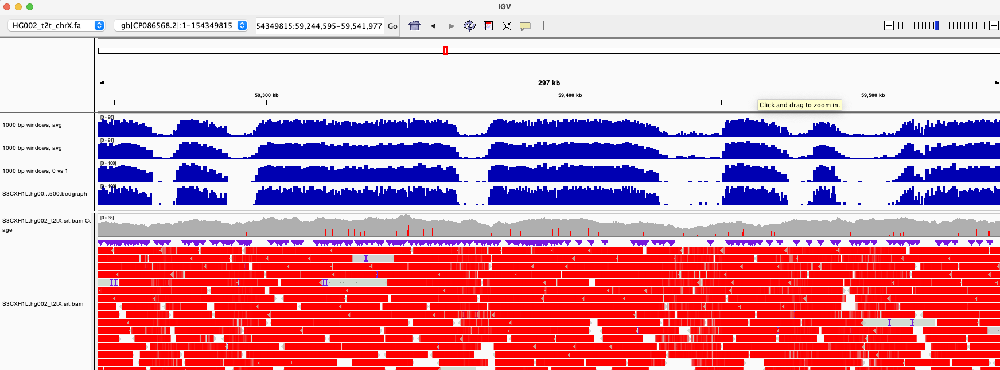
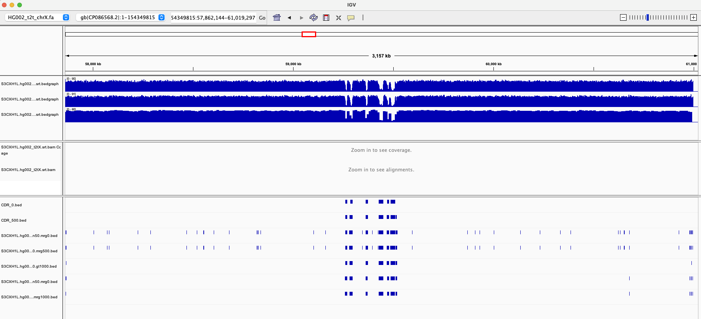
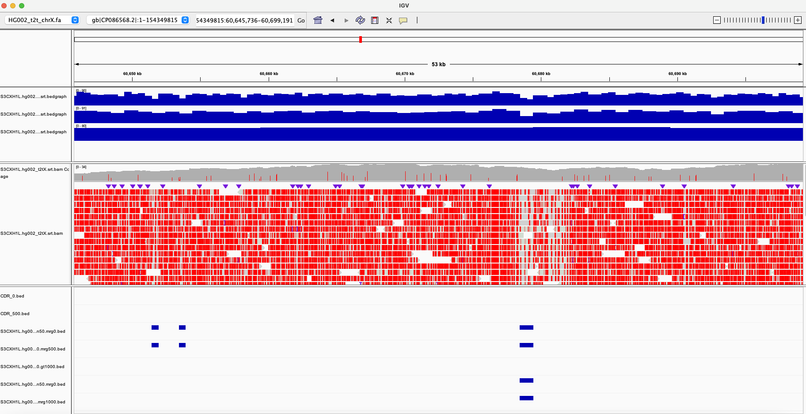
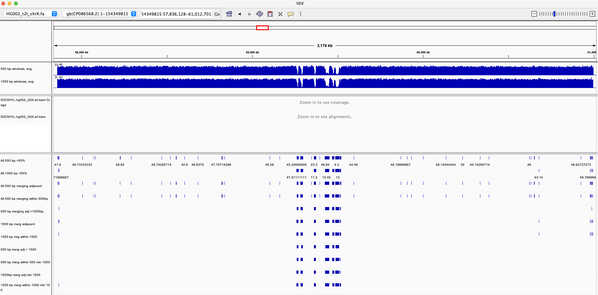

# CDR detect publication analyses

This markdown contains the analyses done for the CDR publication in benchmarking CDR_detect.py and applying it to the HPRC panel of individuals

Table of Contents:
1. [Quantifying CDRs in CHM13 and HG002-t2tX for benchmarking ](##1-quantifying-cdrs-in-chm13-and-hg002-t2tx-for-benchmarking)


## 1. Quantifying CDRs in CHM13 and HG002-t2tX for benchmarking

In order to know whether our method of detecting a CDR from a single read in a reference-free manner is performing well, we need to establish a quantitative method for defining a CDR across a pileup of CpG mod-tagged reads.

The t2t-CHM13 reference and HG002-t2tX assembly have fully resolved centromeric repeats, and their CDRs have already been presented in previous publications (Altemose et. al t2tcensat, Sup Table S11) (Altemose, et al, dimelo-seq), so we can use these as a truthset to benchmark our method before applying it to assemblies with known errors in the centromere / alpha satellites (i.e. HPRC assemblies).

### 1.1 Comparing two ways to smooth methylation calls into windows in an aligned bamfile

#### 1.1A Preparing data
Starting with an aligned bamfile containing [CpG mod samtags](https://samtools.github.io/hts-specs/SAMtags.pdf), we use [pb-cpg tools](https://github.com/PacificBiosciences/pb-CpG-tools) to get 5mC modification probabilities at every CpG site in the genome.

```
# model mode used instead of count mode because it was recommended by authors
conda activate cpg
python /Users/miramastoras/Desktop/Miga_lab/pb-CpG-tools/aligned_bam_to_cpg_scores.py -b /Users/miramastoras/Desktop/IGV_files/S3CXH1L.hg002_t2tX.srt.bam -f /Users/miramastoras/Desktop/IGV_files/HG002_t2t_chrX.fa -o /Users/miramastoras/Desktop/Miga_lab/S3CXHL/S3CXH1L.hg002_t2tX.pb_cpg -p model -d /Users/miramastoras/Desktop/Miga_lab/pb-CpG-tools/pileup_calling_model/ -m reference
```
Next, we make windows of size 500 and 1000 bp across the regions represented in `S3CXH1L.hg002_t2tX.pb_cpg.combined.reference.bed`
```
python3 /Users/miramastoras/Desktop/Miga_lab/CDR_detect/scripts/make_bed_windows.py -b /Users/miramastoras/Desktop/Miga_lab/S3CXHL/S3CXH1L.hg002_t2tX.pb_cpg.combined.reference.bed -s 500

python3 /Users/miramastoras/Desktop/Miga_lab/CDR_detect/scripts/make_bed_windows.py -b /Users/miramastoras/Desktop/Miga_lab/S3CXHL/S3CXH1L.hg002_t2tX.pb_cpg.combined.reference.bed -s 1000
```

##### Method 1: calling each CpG site as 100% or 0% first, then averaging the 100 and 0s in each window

Because pb-cpg tools outputs a probability of methylation at every site (# reads supporting methylation / total number of reads), in this method we convert all probabilities >50% to 100%, and all probabilities <50% to 0% first

```
awk -v OFS='\t' '{if ($4 > 50) {print $1,$2,$3,100} else {print $1,$2,$3,0}}' /Users/miramastoras/Desktop/Miga_lab/S3CXHL/S3CXH1L.hg002_t2tX.pb_cpg.combined.reference.bed > /Users/miramastoras/Desktop/Miga_lab/S3CXHL/S3CXH1L.hg002_t2tX.pb_cpg.combined.reference.0or1bed
```
Next, use bedtools map to get smoothed methylation calls inside of the 500bp and 1000 bp windows
```
bedtools map -a S3CXH1L.hg002_t2tX.pb_cpg.combined.reference.bed_windows1000.bed -b /Users/miramastoras/Desktop/Miga_lab/S3CXHL/S3CXH1L.hg002_t2tX.pb_cpg.combined.reference.0or1bed -c 4 -o mean > /Users/miramastoras/Desktop/Miga_lab/S3CXHL/S3CXH1L.hg002_t2tX.pb_cpg.combined.reference.0or1.smoothed1000.bedgraph

bedtools map -a S3CXH1L.hg002_t2tX.pb_cpg.combined.reference.bed_windows500.bed -b /Users/miramastoras/Desktop/Miga_lab/S3CXHL/S3CXH1L.hg002_t2tX.pb_cpg.combined.reference.0or1bed -c 4 -o mean > /Users/miramastoras/Desktop/Miga_lab/S3CXHL/S3CXH1L.hg002_t2tX.pb_cpg.combined.reference.0or1.smoothed500.bedgraph
```
##### Method 2: Just taking the average of the CpG probability produced by pb-cpg tools in each window.

Directly smoothing the methylation calls output by pb-cpg tools
```
bedtools map -a S3CXH1L.hg002_t2tX.pb_cpg.combined.reference.bed_windows1000.bed -b /Users/miramastoras/Desktop/Miga_lab/S3CXHL/S3CXH1L.hg002_t2tX.pb_cpg.combined.reference.bed -c 4 -o mean > /Users/miramastoras/Desktop/Miga_lab/S3CXHL/S3CXH1L.hg002_t2tX.pb_cpg.combined.reference.smoothed1000.bedgraph

bedtools map -a S3CXH1L.hg002_t2tX.pb_cpg.combined.reference.bed_windows500.bed -b /Users/miramastoras/Desktop/Miga_lab/S3CXHL/S3CXH1L.hg002_t2tX.pb_cpg.combined.reference.bed -c 4 -o mean > /Users/miramastoras/Desktop/Miga_lab/S3CXHL/S3CXH1L.hg002_t2tX.pb_cpg.combined.reference.smoothed500.bedgraph
```

##### Comparing Method 1 and Method 2:



Although the dips are sharper with method 1, we will still have the same regions being called when we pull windows <50% methylated, so it won't make a difference which method we use. I am more inclined toward method 2, because it takes into account the uncertainty in the methylation calls at each site.  Therefore, I will move ahead with method 1.

### 1.2 Choosing a strict and a lenient quantitative definition for a CDR

CDRs are regions of hypomethylation amongst regions of hypermethylation in highly repetitive alpha arrays. They have been associated with the sites of cenpA binding and kinetochore attachment. However, it is not known what the minimum size of a CDR is for cenpa to bind it. In the HG002 chrX array for example, when we look on the scale of the whole array, the 5 previously identified  CDR dips are clear to see.



But, smaller CDR dips are also clear to see when we look on a closer scale



If we are trying to associate regions which bind cenpA using CUT&run with regions containing CDRs, we need to know what defines a CDR, we need to know the size of the dip we are looking for. Excluding these smaller dips may be excluding real regions which bind cenpa, but it also  may confuse our ability to associate repeats with cenpA, if they are actually below the size required to bind it (which is unknown). In my mind this provides a reason to only search for larger CDRs, because we need a different approach to answer the question about minimum CDR size.

In looking to create a quantitative definition of a CDR, I tested several options and visually inspected them against the smoothed methylation windows created in 1.1 and the S3CXHL bam file.



They vary between using 500 bp windows and 1000 bp windows, merging adjacent windows or windows separated by 500 or 1000 bp, and setting a minimum window size after merging (no minimum, 1000 and 1500)

For my strict CDR definition, I've chosen 1000 bp windows, merging adjacent windows <50% methylated and a minimum CDR size of 1500 bp

for my small CDR definition, I've chosen to define a CDR  as any >1000 bp windows where the methylation drops below 50%, merging windows that are within 1 window of each other (1000bp)

#### 1.2A Commands for generating small and large CDR definitions

Run pb-cpg-tools to get probability of base modification at every CpG site using all the reads
```
conda activate cpg
python /Users/miramastoras/Desktop/Miga_lab/pb-CpG-tools/aligned_bam_to_cpg_scores.py -b /Users/miramastoras/Desktop/IGV_files/S3CXH1L.hg002_t2tX.srt.bam -f /Users/miramastoras/Desktop/IGV_files/HG002_t2t_chrX.fa -o /Users/miramastoras/Desktop/Miga_lab/S3CXHL/S3CXH1L.hg002_t2tX.pb_cpg -p model -d /Users/miramastoras/Desktop/Miga_lab/pb-CpG-tools/pileup_calling_model/ -m reference
```
Get windows from bedfile with custom script
```
python3 /Users/miramastoras/Desktop/Miga_lab/CDR_detect/scripts/make_bed_windows.py -b /Users/miramastoras/Desktop/Miga_lab/S3CXHL/S3CXH1L.hg002_t2tX.pb_cpg.combined.reference.bed -s 1000
```
Use bedtools map to get smoothed methylation calls for the windows
```
bedtools map -a S3CXH1L.hg002_t2tX.pb_cpg.combined.reference.bed_windows1000.bed -b S3CXH1L.hg002_t2tX.pb_cpg.combined.reference.bed -c 4 -o mean > S3CXH1L.hg002_t2tX.pb_cpg.combined.reference.smoothed_1000.bed
```

Get all windows < 50% methylated, merge adjacent windows, and choose size based on strict or lenient CDRs
```
awk '$4 < 50' S3CXH1L.hg002_t2tX.pb_cpg.combined.reference.smoothed_1000.bed | bedtools merge -i stdin | awk -v OFS='\t' '{if ($3-$2 > 2000) {print $1,$2,$3}}' > S3CXH1L.hg002_t2tX.strictCDR.bed

awk '$4 < 50' S3CXH1L.hg002_t2tX.pb_cpg.combined.reference.smoothed_1000.bed | bedtools merge -i stdin -d 1000 > S3CXH1L.hg002_t2tX.lenCDR.bed
```

#### 1.2B Looking at dips in CHM13

fix chrom names in chm13 primrose bamfile.
Key located here: https://www.ncbi.nlm.nih.gov/assembly/GCA_009914755.3

chrom_names to genbank :
```
grep -v "^#" GCA_009914755.3_T2T-CHM13v1.1_assembly_report.txt | cut -f1,5 | awk '{print "sed -e " "\s/chr"$1"/"$2"/"}'

cat t2t_cenAnnotation.v2.021921.bed | sed -e 's/chr1/CP068277.2/' | sed -e 's/chr2/CP068276.2/' | sed -e 's/chr3/CP068275.2/' | sed -e 's/chr4/CP068274.2/' | sed -e 's/chr5/CP068273.2/' | sed -e 's/chr6/CP068272.2/' | sed -e 's/chr7/CP068271.2/' | sed -e 's/chr8/CP068270.2/' | sed -e 's/chr9/CP068269.2/' | sed -e 's/chr10/CP068268.2/' | sed -e 's/chr11/CP068267.2/' | sed -e 's/chr12/CP068266.2/' | sed -e 's/chr13/CP068265.2/' | sed -e 's/chr14/CP068264.2/' | sed -e 's/chr15/CP068263.2/' | sed -e 's/chr16/CP068262.2/' | sed -e 's/chr17/CP068261.2/' | sed -e 's/chr18/CP068260.2/' | sed -e 's/chr19/CP068259.2/' | sed -e 's/chr20/CP068258.2/' | sed -e 's/chr21/CP068257.2/' | sed -e 's/chr22/CP068256.2/' | sed -e 's/chrX/CP068255.2/' | sed -e 's/MT/CP068254.1/' > t2t_cenAnnotation.v2.021921.genbank_chrnames.bed
```
genbank -> chrom names
```
grep -v "^#" GCA_009914755.3_T2T-CHM13v1.1_assembly_report.txt | cut -f1,5 | awk '{print "sed -e " "\s/"$2"/chr"$1"/"}'

cat /Users/miramastoras/Desktop/Miga_lab/CHM13_hor/CHM13v1.1.pb_cpg.combined.reference.smoothed1000.bedgraph | sed -e 's/CP068277.2/chr1/' | sed -e 's/CP068276.2/chr2/' | sed -e 's/CP068275.2/chr3/' | sed -e 's/CP068274.2/chr4/' | sed -e 's/CP068273.2/chr5/' | sed -e 's/CP068272.2/chr6/' | sed -e 's/CP068271.2/chr7/' | sed -e 's/CP068270.2/chr8/' | sed -e 's/CP068269.2/chr9/' | sed -e 's/CP068268.2/chr10/' | sed -e 's/CP068267.2/chr11/' | sed -e 's/CP068266.2/chr12/' | sed -e 's/CP068265.2/chr13/' | sed -e 's/CP068264.2/chr14/' | sed -e 's/CP068263.2/chr15/' | sed -e 's/CP068262.2/chr16/' | sed -e 's/CP068261.2/chr17/' | sed -e 's/CP068260.2/chr18/' | sed -e 's/CP068259.2/chr19/' | sed -e 's/CP068258.2/chr20/' | sed -e 's/CP068257.2/chr21/' | sed -e 's/CP068256.2/chr22/' | sed -e 's/CP068255.2/chrX/' | sed -e 's/CP068254.1/MT/'
```

Pull out alpha arrays from [chm13-chm13v1.1 primrose](https://s3-us-west-2.amazonaws.com/human-pangenomics/index.html?prefix=submissions/a211382e-938f-4aa2-8424-1db8fc75a0cd--CHM13-HIFI-METHYLATION-CHM13v1.1/) (on wakanda)

```
cd /data/mira/CDR_detect/data
grep "hor" t2t_cenAnnotation.v2.021921.bed | grep -v "dhor" > t2t_cenAnnotation.v2.021921.hor.bed
bedtools intersect -abam /scratch/mira/chm13.CHM13_v1.1.bam -b /data/mira/CDR_detect/data/t2t_cenAnnotation.v2.021921.genbank_chrnames.bed -wa > /scratch/mira/chm13.CHM13_v1.1.hor.bam
```

Download and run pb-cpg tools on it to get methylation calls per site
```
conda activate cpg
python /Users/miramastoras/Desktop/Miga_lab/pb-CpG-tools/aligned_bam_to_cpg_scores.py -b /Users/miramastoras/Desktop/Miga_lab/CHM13_hor/chm13.CHM13_v1.1.hor.bam -f /Users/miramastoras/Desktop/Miga_lab/CHM13_hor/GCA_009914755.4_T2T-CHM13v2.0_genomic.fna -o /Users/miramastoras/Desktop/Miga_lab/CHM13_hor/CHM13v1.1.pb_cpg -p model -d /Users/miramastoras/Desktop/Miga_lab/pb-CpG-tools/pileup_calling_model/ -m reference
```
Smooth results into 1000 bp windows
```
# make windows
python3 /Users/miramastoras/Desktop/Miga_lab/CDR_detect/scripts/make_bed_windows.py -b /Users/miramastoras/Desktop/Miga_lab/CHM13_hor/CHM13v1.1.pb_cpg.combined.reference.bed -s 1000
# smooth cpg in windows
bedtools map -a /Users/miramastoras/Desktop/Miga_lab/CHM13_hor/CHM13v1.1.pb_cpg.combined.reference.bed_windows1000.srt.bed -b /Users/miramastoras/Desktop/Miga_lab/CHM13_hor/CHM13v1.1.pb_cpg.combined.reference.bed -c 4 -o mean > /Users/miramastoras/Desktop/Miga_lab/CHM13_hor/CHM13v1.1.pb_cpg.combined.reference.smoothed1000.bedgraph
```

CHM13 has a lower level of methylation than is normal, and will therefore require different parameters than normal cell lines, so we can't use it to benchmark actually.

## 2. Benchmark CDR_detect performance in HG002 t2t-X

### 2.1 Description of CDR_detect.py

### 2.2 Testing best parameters on strict and lenient CDR definition


## 3. Run CDR_detect across HPRC individuals hifi data

HOR boundaries annotations for every individual:
https://storage.googleapis.com/masri/hprc/hprc_hors.tar.gz
AS HOR - monomer level
https://s3-us-west-2.amazonaws.com/human-pangenomics/index.html?prefix=submissions/08934468-0AE3-42B6-814A-C5422311A53D--HUMAS_HMMER/

Hifi alignments located here in  `read alignment diploid`
https://app.terra.bio/#workspaces/human-pangenome-ucsc/coverage_GenBank/data

primrose data (unaligned) here:
https://s3-us-west-2.amazonaws.com/human-pangenomics/index.html?prefix=submissions/560047a6-6d16-4b0c-aac9-7d0c83e2188e--HIFI-METHYLATION-READS/

script for extracting reads: https://github.com/timoast/ngs-tools/blob/master/extract_reads.py

### 3.1 First pass: HG001243, HG005, HG02055

Use secphase to correct read alignments
```
# HG005
docker run -it \
-v /scratch/mira:/scratch/mira \
-v /scratch/mira:/scratch/mira \
-v /public:/public \
-u `id -u`:`id -g` --ipc host \
mobinasri/secphase:v0.1 \
correct_bam \
-i /scratch/mira/HG005.diploid.f1_assembly_v2_genbank.hifi.winnowmap_v2.03.bam \
-p /scratch/mira/HG005.diploid.f1_assembly_v2_genbank.hifi.winnowmap_v2.03.correctbam.log \
-o /scratch/mira/HG005.diploid.f1_assembly_v2_genbank.hifi.winnowmap_v2.03.secphase.bam \
--primaryOnly --threads 32

# HG01243
docker run -it \
-v /scratch/mira:/scratch/mira \
-v /scratch/mira:/scratch/mira \
-v /public:/public \
-u `id -u`:`id -g` --ipc host \
mobinasri/secphase:v0.1 \
correct_bam \
-i /scratch/mira/HG01243.diploid.f1_assembly_v2_genbank.hifi.winnowmap_v2.03.bam \
-p /scratch/mira/HG01243.diploid.f1_assembly_v2_genbank.hifi.winnowmap_v2.03.correctbam.log \
-o /scratch/mira/HG01243.diploid.f1_assembly_v2_genbank.hifi.winnowmap_v2.03.secphase.bam \
--primaryOnly --threads 32

# HG02055
docker run -it \
-v /scratch/mira:/scratch/mira \
-v /scratch/mira:/scratch/mira \
-v /public:/public \
-u `id -u`:`id -g` --ipc host \
mobinasri/secphase:v0.1 \
correct_bam \
-i /scratch/mira/HG02055.diploid.f1_assembly_v2_genbank.hifi.winnowmap_v2.03.bam \
-p /scratch/mira/HG02055.diploid.f1_assembly_v2_genbank.hifi.winnowmap_v2.03.correctbam.log \
-o /scratch/mira/HG02055.diploid.f1_assembly_v2_genbank.hifi.winnowmap_v2.03.secphase.bam \
--primaryOnly --threads 32
```
Pull out the alpha satelites HOR (at the monomer level of annotation from HUMAS_HMMER)
Get list of readnames
```
cat AS-HOR-vs-HG005-paternal.bed AS-HOR-vs-HG005-maternal.bed > AS-HOR-vs-HG005-dip.bed
cat AS-HOR-vs-HG01243-paternal.bed AS-HOR-vs-HG01243-maternal.bed > AS-HOR-vs-HG01243-dip.bed
cat AS-HOR-vs-HG02055-paternal.bed AS-HOR-vs-HG02055-maternal.bed > AS-HOR-vs-HG02055-dip.bed
bedtools sort -i AS-HOR-vs-HG005-dip.bed > AS-HOR-vs-HG005-dip.srt.bed
bedtools sort -i AS-HOR-vs-HG01243-dip.bed > AS-HOR-vs-HG01243-dip.srt.bed
bedtools sort -i AS-HOR-vs-HG02055-dip.bed > AS-HOR-vs-HG02055-dip.srt.bed

bedtools intersect -abam /scratch/mira/HG01243.diploid.f1_assembly_v2_genbank.hifi.winnowmap_v2.03.secphase.bam  -b /scratch/mira/AS-HOR-vs-HG01243-dip.srt.bed -wa > /scratch/mira/HG01243.diploid.f1_assembly_v2_genbank.hifi.winnowmap_v2.03.secphase.AS-HOR.bam
samtools index /scratch/mira/HG01243.diploid.f1_assembly_v2_genbank.hifi.winnowmap_v2.03.secphase.AS-HOR.bam

bedtools intersect -abam /scratch/mira/HG02055.diploid.f1_assembly_v2_genbank.hifi.winnowmap_v2.03.secphase.bam  -b /scratch/mira/AS-HOR-vs-HG02055-dip.srt.bed -wa > /scratch/mira/HG02055.diploid.f1_assembly_v2_genbank.hifi.winnowmap_v2.03.secphase.AS-HOR.bam
samtools index /scratch/mira/HG02055.diploid.f1_assembly_v2_genbank.hifi.winnowmap_v2.03.secphase.AS-HOR.bam


rm /scratch/mira/HG005.diploid.f1_assembly_v2_genbank.hifi.winnowmap_v2.03.secphase.bam
rm /scratch/mira/HG005.diploid.f1_assembly_v2_genbank.hifi.winnowmap_v2.03.bam
rm AS-HOR-vs-HG005-paternal.bed AS-HOR-vs-HG005-maternal.bed

samtools view /scratch/mira/HG005.diploid.f1_assembly_v2_genbank.hifi.winnowmap_v2.03.secphase.AS-HOR.bam | cut -f1 > /scratch/mira/HG005_hifi_AS-HOR_readnames.txt
samtools view /scratch/mira/HG01243.diploid.f1_assembly_v2_genbank.hifi.winnowmap_v2.03.secphase.AS-HOR.bam | cut -f1 > /scratch/mira/HG01243_hifi_AS-HOR_readnames.txt
samtools view /scratch/mira/HG02055.diploid.f1_assembly_v2_genbank.hifi.winnowmap_v2.03.secphase.AS-HOR.bam | cut -f1 > /scratch/mira/HG02055_hifi_AS-HOR_readnames.txt


```

Pull out these readnames from the primrose data. First need to map the primrose reads so we can pull out read names with pysam (or else we would need to use fgrep which is too slow)
```
conda activate CDR-detect
ls *bam | while read line ; do echo $line ; done >> HG005.fofn
pbmm2 align /data/mira/reference/GCA_000001405.15_GRCh38_no_alt_analysis_set.header.fa HG01243.fofn HG01243.hifi_reads_hg38.bam
pbmm2 align /data/mira/reference/GCA_000001405.15_GRCh38_no_alt_analysis_set.header.fa HG005.fofn HG005.hifi_reads_hg38.bam
pbmm2 align /data/mira/reference/GCA_000001405.15_GRCh38_no_alt_analysis_set.header.fa HG02055.fofn HG02055.hifi_reads_hg38.bam
python3 /public/home/miramastoras/progs/scripts/extract_reads.py -b /scratch/mira/HG005_primrose/HG005.hifi_reads_hg38.bam -n /scratch/mira/HG005_hifi_AS-HOR_readnames.txt -o /scratch/mira/HG005_primrose/HG005.hifi_reads_hg38.AS-HOR.bam

python3 /public/home/miramastoras/progs/scripts/extract_reads.py -b /scratch/mira/HG01243_primrose/HG01243.hifi_reads_hg38.bam -n /scratch/mira/HG01243_hifi_AS-HOR_readnames.txt -o /scratch/mira/HG01243_primrose/HG01243.hifi_reads_hg38.AS-HOR.bam

python3 /public/home/miramastoras/progs/scripts/extract_reads.py -b /scratch/mira/HG02055_primrose/HG02055.hifi_reads_hg38.bam -n /scratch/mira/HG02055_hifi_AS-HOR_readnames.txt -o /scratch/mira/HG02055_primrose/HG02055.hifi_reads_hg38.AS-HOR.bam
```

run CDR detect on the primrose data
```
samtools sort /scratch/mira/HG005_primrose/HG005.hifi_reads_hg38.AS-HOR.bam > /scratch/mira/HG005_primrose/HG005.hifi_reads_hg38.AS-HOR.srt.bam
samtools index /scratch/mira/HG005_primrose/HG005.hifi_reads_hg38.AS-HOR.srt.bam

python3 /public/home/miramastoras/progs/scripts/CDR_detect.py -b /scratch/mira/HG005_primrose/HG005.hifi_reads_hg38.AS-HOR.srt.bam -o /data/mira/CDR_detect/results/HG005.hifi
python3 /public/home/miramastoras/progs/scripts/CDR_detect.py -b /scratch/mira/HG01243_primrose/HG01243.hifi_reads_hg38.AS-HOR.srt.bam -o /data/mira/CDR_detect/results/HG01243.hifi
python3 /public/home/miramastoras/progs/scripts/CDR_detect.py -b /scratch/mira/HG02055_primrose/HG02055.hifi_reads_hg38.AS-HOR.srt.bam -o /data/mira/CDR_detect/results/HG02055.hifi
```

subset original hifi aligned bam with CDR readnames
```
python3 /public/home/miramastoras/progs/scripts/extract_reads.py -b /scratch/mira/HG005.diploid.f1_assembly_v2_genbank.hifi.winnowmap_v2.03.secphase.AS-HOR.bam -n /data/mira/CDR_detect/results/HG005.hifi_CDR.txt -o /scratch/mira/HG005.diploid.f1_assembly_v2_genbank.hifi.winnowmap_v2.03.secphase.AS-HOR.CDRs.bam

python3 /public/home/miramastoras/progs/scripts/extract_reads.py -b /scratch/mira/HG02055.diploid.f1_assembly_v2_genbank.hifi.winnowmap_v2.03.secphase.AS-HOR.bam -n /data/mira/CDR_detect/results/HG02055.hifi_CDR.txt -o /scratch/mira/HG02055.diploid.f1_assembly_v2_genbank.hifi.winnowmap_v2.03.secphase.AS-HOR.CDRs.bam

python3 /public/home/miramastoras/progs/scripts/extract_reads.py -b /scratch/mira/HG01243.diploid.f1_assembly_v2_genbank.hifi.winnowmap_v2.03.secphase.AS-HOR.bam -n /data/mira/CDR_detect/results/HG01243.hifi_CDR.txt -o /scratch/mira/HG01243.diploid.f1_assembly_v2_genbank.hifi.winnowmap_v2.03.secphase.AS-HOR.CDRs.bam
```
Associate read with array
Get text file with read name, contig, start coord, read length
```
samtools sort /scratch/mira/HG005.diploid.f1_assembly_v2_genbank.hifi.winnowmap_v2.03.secphase.AS-HOR.CDRs.bam > /scratch/mira/HG005.diploid.f1_assembly_v2_genbank.hifi.winnowmap_v2.03.secphase.AS-HOR.CDRs.srt.bam
samtools index /scratch/mira/HG005.diploid.f1_assembly_v2_genbank.hifi.winnowmap_v2.03.secphase.AS-HOR.CDRs.srt.bam

samtools view /scratch/mira/HG005.diploid.f1_assembly_v2_genbank.hifi.winnowmap_v2.03.secphase.AS-HOR.CDRs.srt.bam | awk '{print $3"\t"$4"\t"$4+length($10)"\t"$1}' > HG005_hifi_diploid_CDRreads.bed
bedtools map -a HG005_hifi_diploid_CDRreads.bed -b /scratch/mira/AS-HOR-vs-HG005-dip.srt.bed -c 4 -o collapse > /data/mira/CDR_detect/results/HG005_hifi_diploid_CDRreads_HUMAS_HMMER_annotations.txt


samtools view /scratch/mira/HG01243.diploid.f1_assembly_v2_genbank.hifi.winnowmap_v2.03.secphase.AS-HOR.CDRs.srt.bam | awk '{print $3"\t"$4"\t"$4+length($10)"\t"$1}' > HG01243_hifi_diploid_CDRreads.bed
bedtools map -a HG01243_hifi_diploid_CDRreads.bed -b /scratch/mira/AS-HOR-vs-HG01243-dip.srt.bed -c 4 -o collapse > /data/mira/CDR_detect/results/HG01243_hifi_diploid_CDRreads_HUMAS_HMMER_annotations.txt


samtools view /scratch/mira/HG02055.diploid.f1_assembly_v2_genbank.hifi.winnowmap_v2.03.secphase.AS-HOR.CDRs.srt.bam | awk '{print $3"\t"$4"\t"$4+length($10)"\t"$1}' > HG02055_hifi_diploid_CDRreads.bed
bedtools map -a HG02055_hifi_diploid_CDRreads.bed -b /scratch/mira/AS-HOR-vs-HG02055-dip.srt.bed -c 4 -o collapse > /data/mira/CDR_detect/results/HG02055_hifi_diploid_CDRreads_HUMAS_HMMER_annotations.txt

echo "#contig read_start read_end read_id HUMAS_HMMER_annotation"
```
Subset primrose bam with CDR detect reads to get fastq sequences for them
```
python3 /public/home/miramastoras/progs/scripts/extract_reads.py -b /scratch/mira/HG005_primrose/HG005.hifi_reads_hg38.AS-HOR.srt.bam -n /data/mira/CDR_detect/results/HG005.hifi_CDR.txt -o /scratch/mira/HG005_primrose/HG005.hifi_reads_hg38.AS-HOR.CDRs.bam

python3 /public/home/miramastoras/progs/scripts/extract_reads.py -b /scratch/mira/HG01243_primrose/HG01243.hifi_reads_hg38.AS-HOR.srt.bam -n /data/mira/CDR_detect/results/HG01243.hifi_CDR.txt -o /scratch/mira/HG01243_primrose/HG01243.hifi_reads_hg38.AS-HOR.CDRs.bam

python3 /public/home/miramastoras/progs/scripts/extract_reads.py -b /scratch/mira/HG02055_primrose/HG02055.hifi_reads_hg38.AS-HOR.srt.bam -n /data/mira/CDR_detect/results/HG02055.hifi_CDR.txt -o /scratch/mira/HG02055_primrose/HG02055.hifi_reads_hg38.AS-HOR.CDRs.bam

bedtools bamtofastq -i /scratch/mira/HG005_primrose/HG005.hifi_reads_hg38.AS-HOR.CDRs.bam -fq /scratch/mira/HG005_primrose/HG005_diploid_hifi_CDRreads.fastq
bedtools bamtofastq -i /scratch/mira/HG02055_primrose/HG02055.hifi_reads_hg38.AS-HOR.CDRs.bam -fq /scratch/mira/HG02055_primrose/HG02055_diploid_hifi_CDRreads.fastq
bedtools bamtofastq -i /scratch/mira/HG01243_primrose/HG01243.hifi_reads_hg38.AS-HOR.CDRs.bam -fq /scratch/mira/HG01243_primrose/HG01243_diploid_hifi_CDRreads.fastq
```

### 3.2 wdl workflow for 3.1

```
input files:
- primrose bamfiles
- corrected hifi to assembly alignments
- hummer annotation bedfile
- assemblies

workspace files:
- hg38

tasks:
- pull out alpha satelites from corrected hifi assembly aligned bam, get their readnames
- map primrose to hg38 with pbmm2
- pull out HORs using readnames file from primrose data using script
- run CDR detect on primrose data
- subset  primrose bam with CDR readnames and get fastq sequences for them
- subset hifi bam with cdr names to get txt file

Docker reqs:
- pysam
- CDR_detect.py
- extract_reads.py
- pbmm2
- samtools
- bedtools
```

Testing fgrep instead to subset bam
```
time samtools cat m64017_200723_190224.hifi_reads.bam m64017_200730_190124.hifi_reads.bam m64017_200801_011415.hifi_reads.bam m64017_200802_073944.hifi_reads.bam -o HG005_primrose.bam

real    11m52.698s
user    0m2.856s
sys     0m50.919s

time samtools view -H HG005_primrose.bam > HG005_HORs.bam # 0s
time samtools view HG005_primrose.bam | fgrep -w -f /scratch/mira/HG005_hifi_AS-HOR_readnames.txt >> HG005_HORs.bam

ls *bam | while read line ; do echo $line ; done >> HG005.fofn
time pbmm2 align /data/mira/reference/GCA_000001405.15_GRCh38_no_alt_analysis_set.header.fa HG005.fofn HG005.hifi_reads_hg38.bam
real    49m5.840s
user    2590m7.326s
sys     24m57.544s
time python3 /public/home/miramastoras/progs/scripts/extract_reads.py -b HG005.hifi_reads_hg38.bam -n /scratch/mira/HG005_hifi_AS-HOR_readnames.txt -o HG005.hifi_reads_hg38.AS-HOR.testmap.bam # 13 mins

java -jar /public/home/miramastoras/progs/picard.jar AddOrReplaceReadGroups I=/scratch/mira/HG005_primrose/HG005_primrose.bam \
        O=/scratch/mira/HG005_primrose/HG005_primrose.rg.bam

time samtools view -H /scratch/mira/HG005_primrose/HG005_primrose.bam | grep -v "^@RG" | samtools reheader - /scratch/mira/HG005_primrose/HG005_primrose.bam > /scratch/mira/HG005_primrose/HG005_primrose.reheader.bam

time java -jar /public/home/miramastoras/progs/picard.jar FilterSamReads \
       I=/scratch/mira/HG005_primrose/HG005_primrose.bam \
       O=/scratch/mira/HG005_primrose/HG005.primrose.AS-HOR.picardtest.bam \
       READ_LIST_FILE=/scratch/mira/HG005_hifi_AS-HOR_readnames.txt FILTER=includeReadList
```
Validate wdl with womtool
```
java -jar /public/home/miramastoras/progs/womtool-72.jar validate /data/mira/CDR_detect/test/CDR_detect/scripts/CDR_detect.wdl
java -jar /public/home/miramastoras/progs/womtool-72.jar inputs /data/mira/CDR_detect/test/CDR_detect/scripts/CDR_detect.wdl >> HG01243_wdl_inputs.json
```
run wdl on server
```
/data/mira/PhaseReads_Eval/scripts/cromwell run /data/mira/CDR_detect/test/CDR_detect/scripts/CDR_detect.wdl -i /data/mira/CDR_detect/HG01243_wdl_inputs.json
```

```json
{
  "runCDRdetect.matHORBed": "/scratch/mira/AS-HOR-vs-HG01243-maternal.bed",
  "runCDRdetect.patHORBed": "/scratch/mira/AS-HOR-vs-HG01243-paternal.bed",
  "runCDRdetect.sampleName": "HG01243",
  "runCDRdetect.primroseBams": ["/scratch/mira/HG01243_primrose/m64136_200827_191603.hifi_reads.bam","/scratch/mira/HG01243_primrose/m64136_200829_012933.hifi_reads.bam","/scratch/mira/HG01243_primrose/m64136_200830_075556.hifi_reads.bam"],
  "runCDRdetect.secPhaseHifiBam": "/scratch/mira/HG01243.diploid.f1_assembly_v2_genbank.hifi.winnowmap_v2.03.secphase.AS-HOR.bam"
}

```

testing docker
```
docker run \
    -i \
    -t ubuntu:18.04 \
    /bin/bash
```
## 4. Expand CDR_detect to ONT data
