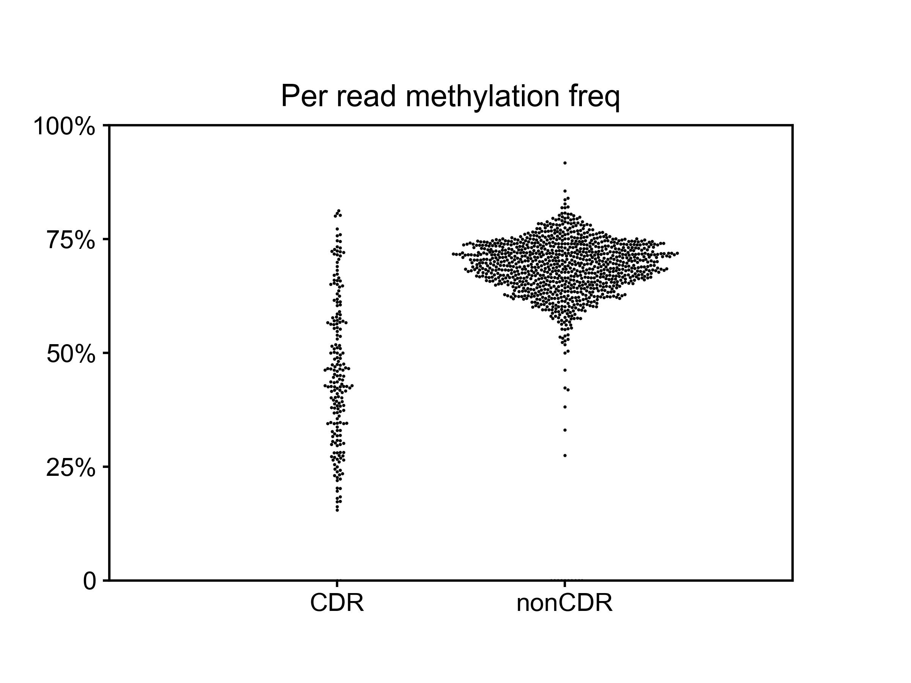

### Motivation for method

Swarm plot depicting per - read average methylation frequency of CDR and non CDR reads in HG002 T2T-X



### Developing the method

#### 1. Quantifying CDRs using HG002 t2t-x (Defining "truth")

We used [pb-cpg tools](https://github.com/PacificBiosciences/pb-CpG-tools) script to get a methylation probability for every CpG site based on all reads aligned to that site, because we have good alignments for HG002 T2T chr X alpha HOR arrays

Then, we smoothed the methylation into 500 bp windows, and define a CDR as any region > 1500 bp where the methylation drops below 50%


#### 2. Reference free CDR detection method

For every read, calculate the average methylation frequency across the entire read. If it is <40% (t), automatically call it a CDR containing read.

If the average methylation for a read is >40%, move in a sliding window of size 3000 bp (w) across the read, over by 1 bp each time (o), and check if the average methylation in that window drops below 30% (x). Whenever it does, exit and call that read "cdr containing".

Parameters used in the method:
```
w = window size in bp
t = methylation frequency of a read below which to automatically call it a CDR read
x = methylation frequency of a sliding window of size w below which to call the read a CDR read
o = sliding window step size, number of bp to move sliding window over by each time
```
location of script: https://github.com/miramastoras/CDR_detect/scripts/CDR_detect.py

#### 3. Performance of reference free CDR detection

Using window sizes of 3000 bp, threshold for window methylation of 30%, threshold for entire read methylation of 40%, and sliding window step size of 1bp (optimal parameters for w,t,x, and o on HG002 t2t-x):

```
Precision : 0.8991596639
Recall : 0.8045112782
F-1 score : 0.8492063492
```
